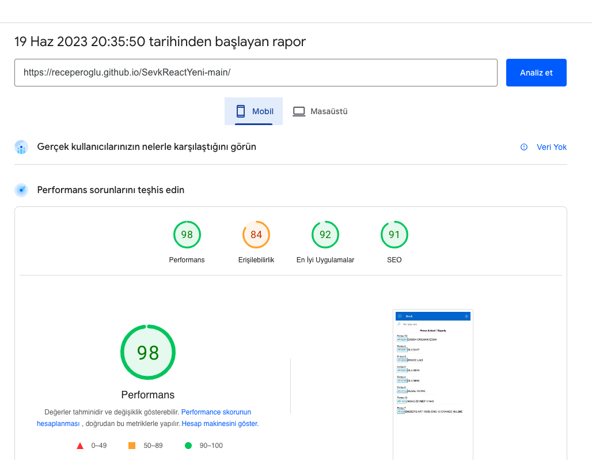
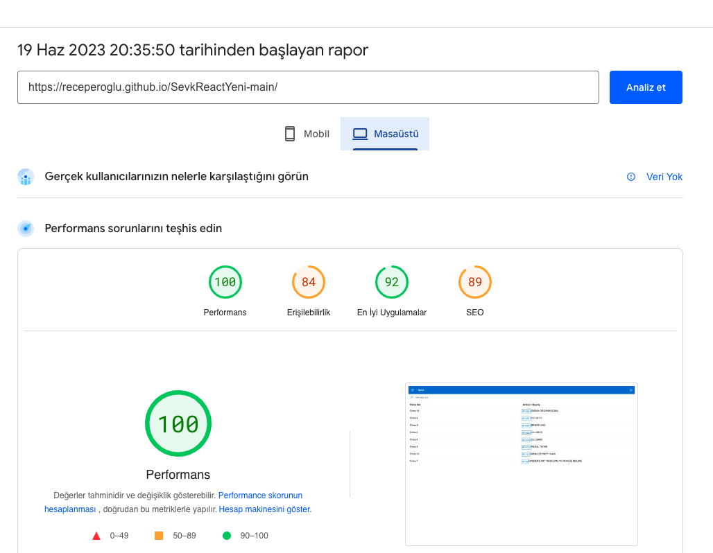

# SevkReact
 
Bu proje firmanıza ait müşterilerden gelen siparişlerin müşterilere atanmasını ve takibini kolaylaştırır. 
Üretim süreçlerinde adet ve ağırlık takibi yapabilmek için oluşturulmuştur. 
Siparişe ait sipariş formunun fotoğrafının çekilmesi sistemde saklanmasını sağlar.
Ayrıca excel,word,powerpoint sunularınızı saklayıp görüntülemenizi sağlar.
Siparişlerin parçalı teslimi durumunda ne zaman ve hangi irsaliye numarası ile gönderildiğini de tutar.
Böylece farklı üretim elemanları/vardiyalardan bağımsız sipariş üretim sürecini takip edebilirsiniz.

This project facilitates the assignment and follow-up of orders from customers of your company to customers.
It was created to track the quantity and weight in the production processes.
Taking a photo of the order form for the order ensures that it is stored in the system.
It also allows you to store and view your excel, word, powerpoint presentations.
In case of partial delivery of orders, it also keeps track of when and with which waybill number they were sent.
Thus, you can follow the order production process independent of different production staff/shifts.

Bu proje react js context api yapısı ile oluşturulmuştur.

 Microsoft fluent ui tasarım ve renklerini kullanır.
 Ticari bir amacı yoktur. 

Proje Pagespeed başarımı

 